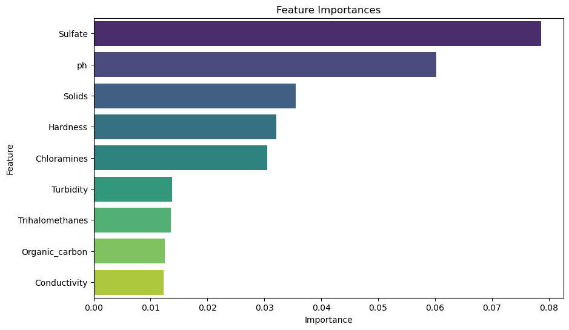

# Utilizing Classifiers to Predict Water Potability

**Author**
Shaurya Srivastava

## Executive summary

**Project overview and goals:**
This project aims to assess water potability through the evaluation of optimal classification models. Five distinct types of classifier models will be trained using different scoring methods and sampling types on the training data to accurately determine whether water is potable based on its known attributes. Comparative analysis will be conducted to gauge the performance of each model, ultimately finding the best one. An in-depth examination of the superior model will be conducted to identify the key factors determining water potability. These findings will inform recommendations for future research directions and strategies to enhance water potability classification methodologies.

**Findings:**
The best performing model with the highest precision for identifying water potability is the Support Vector Classifier model with no sampling and trained on accuracy. The SVM model had an accuracy of 0.659, precision of 0.686, and roc_auc of 0.581. The best overall model is the Random Forest Classifier model trained on accuracy with oversampling. The Random Forest model had an accuracy of 0.659, precision of 0.605, and roc_auc of 0.605.

**Results and conclusion:**
The Random Forest Classifier model trained on accuracy with oversampling is the best overall model due to the faster training time, high train and test score, and the highest average of scores over all the scoring types.

All features are equally important to determine water potability.

The Support Vector Classifier model with no sampling and trained on accuracy is the most performant model with the highest accuracy and precision.

The most important features used to determine water potability are Sulfates and PH, followed by Solids, Hardness, and Chloramines.

**Next steps and recommendations:**
Based on the findings, either the Random Classifier model trained for accuracy with oversampled training data or the Support Vector Classifier model with no sampling and trained on accuracy can be used as the primary choice for determining potability of water. However, none of the models exhibited exceptional performance, as indicated by accuracy and precision metrics remaining under 70%. Hence, while the models can provide valuable insights, it should be regarded as advisory rather than definitive.

To enhance predictive capabilities and reliability, several recommendations are proposed:

1. Enhanced Data Collection: Acquire more precise and comprehensive data pertaining to water sources and their potability. This can involve gathering information from diverse geographic locations, considering various water treatment methods, and encompassing a wider range of parameters influencing water quality.

2. Exploration of Modern Machine Learning Techniques: Conduct experimentation with neural network architectures to see if better performance can be achieved.

3. Feature Engineering: Explore feature engineering techniques to derive new features by combining existing ones. By synthesizing meaningful features, the classifiers can potentially leverage richer information for improved predictions.

4. Random State Variation: Train the models on different random states to assess the robustness and stability of the predictions across varied training instances. This can help in identifying any inherent biases or inconsistencies in the model's performance.

By implementing these recommendations, it's anticipated that the predictive accuracy and reliability of the models can be substantially enhanced.

## Rationale

This question holds importance due to the essential nature of water for human survival. Despite its abundance, not all water sources are suitable for consumption. Distinguishing potable water from non-potable sources is challenging. Developing a high-precision model classifier that identifies key indicators of water potability would greatly assist individuals in discerning when it is safe to drink from water sources.

## Research Question

With limited access to water in certain regions, can we accurately and precisely predict if a water source is drinkable based on water properties? Which properties contribute the most to whether water is drinkable or not?

## Data Sources

The data source is a dataset containing water portability data from Kaggle. [Link to dataset](https://www.kaggle.com/datasets/adityakadiwal/water-potability).

## Methodology

This is a classification problem that will determine whether water with certain properties is potable (1) or not potable (0). The model classifiers that are explored are Logistic Regression, Decision Trees, KNN, SVMs, and Random Forest. I trained each model on five different types: accuracy, precision, recall. f1, and ROC AUC. Four types of sampling of the training data was done for each model type trained: no sampling, random undersampling, random oversampling, and SMOTE. Each model used grid search to train on a different set of hyperparameters to determine the best classifier. I utilized CRISP-DM techniques, exploratory data analysis, cross validation, hyperparameter tuning, and data pipelines.

## Results

After conducting exploratory data analysis and building classifier models, it can be concluded that we cannot accurately or precisely predict if a water source is drinkable based on water properties. I trained 5 models: Logistic Regression, KNN, Decision Tree, SVM, and Random Forest. All 5 models had an accuracy under 70%.

The best performing model with the highest precision for identifying water potability is the Support Vector Classifier model with no sampling and trained on accuracy. The SVM model had an accuracy of 0.659, precision of 0.686, and roc_auc of 0.581. The best overall model is the Random Forest Classifier model trained on accuracy with oversampling. The Random Forest model had an accuracy of 0.659, precision of 0.605, and roc_auc of 0.605. The Random Classifier is the best overall model due to the faster training time, high train and test score, and the highest average of scores over all the scoring types.

### Top 5 Performing Classifier Models

| model         | sampling   | scorer   |   train_score |   test_score |   accuracy |   precision |   recall |       f1 |   roc_auc | best_params                                                                                                                       |
|:--------------|:-----------|:---------|--------------:|-------------:|-----------:|------------:|---------:|---------:|----------:|:----------------------------------------------------------------------------------------------------------------------------------|
| SVM           | none       | accuracy |      0.679541 |     0.658537 |   0.658537 |    0.686047 | 0.230469 | 0.345029 |  0.581484 | {'svm__C': 1, 'svm__gamma': 0.1, 'svm__kernel': 'rbf'}                                                                            |
| Random Forest | over       | accuracy |      0.79132  |     0.658537 |   0.658537 |    0.605263 | 0.359375 | 0.45098  |  0.604688 | {'rf__criterion': 'entropy', 'rf__max_depth': 30, 'rf__min_samples_leaf': 1, 'rf__min_samples_split': 5, 'rf__n_estimators': 300} |
| Random Forest | over       | roc_auc  |      0.791221 |     0.604688 |   0.658537 |    0.605263 | 0.359375 | 0.45098  |  0.604688 | {'rf__criterion': 'entropy', 'rf__max_depth': 30, 'rf__min_samples_leaf': 1, 'rf__min_samples_split': 5, 'rf__n_estimators': 300} |
| Random Forest | none       | accuracy |      0.680534 |     0.653963 |   0.653963 |    0.623932 | 0.285156 | 0.391421 |  0.587578 | {'rf__criterion': 'gini', 'rf__max_depth': 20, 'rf__min_samples_leaf': 1, 'rf__min_samples_split': 5, 'rf__n_estimators': 200}    |
| SVM           | none       | recall   |      0.413356 |     0.328125 |   0.650915 |    0.595745 | 0.328125 | 0.423174 |  0.592812 | {'svm__C': 10, 'svm__gamma': 0.1, 'svm__kernel': 'rbf'}                                                                           |

### Best Performining Models for Each Classifier Type

| model               | sampling   | scorer    |   train_score |   test_score |   accuracy |   precision |    recall |        f1 |   roc_auc | best_params                                                                                                                       |
|:--------------------|:-----------|:----------|--------------:|-------------:|-----------:|------------:|----------:|----------:|----------:|:----------------------------------------------------------------------------------------------------------------------------------|
| Decision Tree       | none       | recall    |      0.324754 |     0.199219 |   0.618902 |    0.53125  | 0.199219  | 0.289773  |  0.543359 | {'dt__criterion': 'gini', 'dt__max_depth': 9, 'dt__min_samples_leaf': 1, 'dt__min_samples_split': 2}                              |
| KNN                 | none       | precision |      0.624408 |     0.633333 |   0.646341 |    0.633333 | 0.222656  | 0.32948   |  0.570078 | {'knn__n_neighbors': 21, 'knn__weights': 'distance'}                                                                              |
| Logistic Regression | none       | accuracy  |      0.611832 |     0.612805 |   0.612805 |    1        | 0.0078125 | 0.0155039 |  0.503906 | {'lgr__C': 0.1}                                                                                                                   |
| Random Forest       | over       | accuracy  |      0.79132  |     0.658537 |   0.658537 |    0.605263 | 0.359375  | 0.45098   |  0.604688 | {'rf__criterion': 'entropy', 'rf__max_depth': 30, 'rf__min_samples_leaf': 1, 'rf__min_samples_split': 5, 'rf__n_estimators': 300} |
| SVM                 | none       | accuracy  |      0.679541 |     0.658537 |   0.658537 |    0.686047 | 0.230469  | 0.345029  |  0.581484 | {'svm__C': 1, 'svm__gamma': 0.1, 'svm__kernel': 'rbf'}                                                                            |

## Next steps

Based on the results of the exploratory data analysis and the performance of the classifier models, here are some suggestions for potential next steps:

- Collect more accurate data of water sources and whether it is potable.
  - Good data and numerous data seems to be the limiting factor for highly performant classifier models that predict with high accuracy and precision if water is potable
- Use modern methods of machine learning (i.e. neural networks) to see if classification is better
- Try multiple random states for the train test split and the classifier models
- Feature Engineering to provide richer information

## Outline of project

- [Dataset](https://www.kaggle.com/datasets/adityakadiwal/water-potability)
- [EDA](./notebooks/(1)%20water_potability_eda.ipynb)
- [Initial Analysis](./notebooks/(2)%20water_potability_initial_analysis.ipynb)
- [Final Analysis](./notebooks/(3)%20water_potability_final_analysis.ipynb)
- [Model Weights](./models/)

## Contact and Further Information

Feel free to contact me at my [LinkedIn](https://www.linkedin.com/in/shauryas481/) if you have questions or comments. 